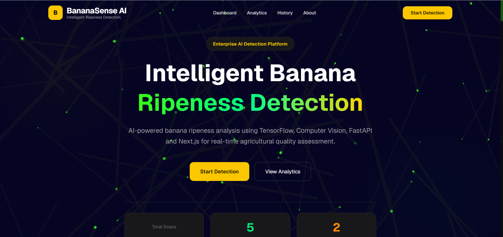
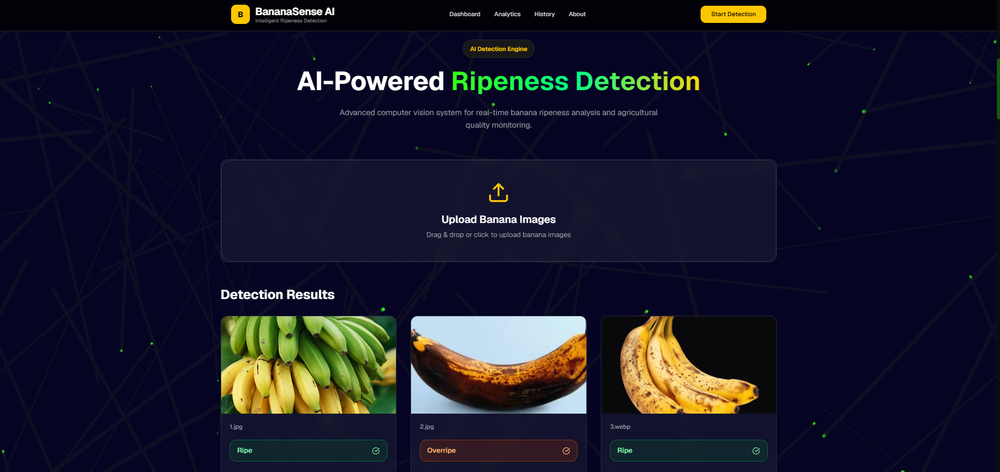
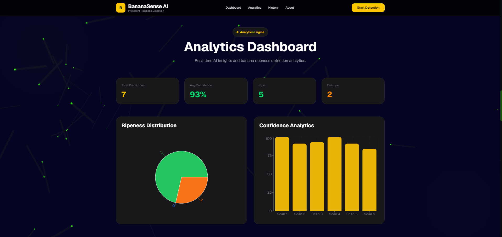
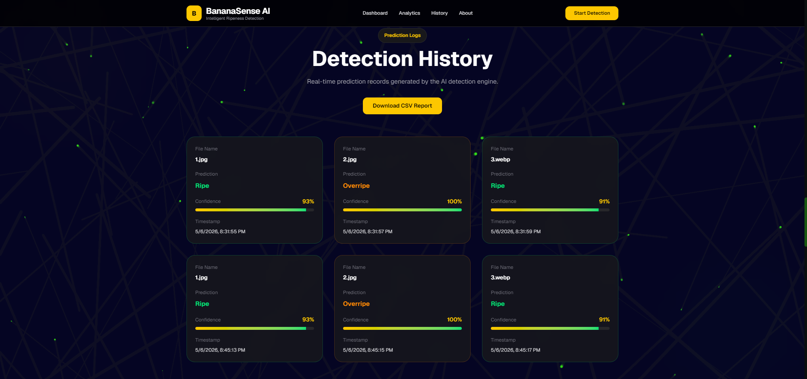

# BananaSense AI

<p align="center">

Advanced AI-powered banana ripeness detection platform built using TensorFlow, MobileNetV2, FastAPI, and Next.js.

</p>

<p align="center">


</p>

---

## Live Deployment

### Frontend

https://banana-sense-ai.vercel.app/#dashboard

### GitHub Repository

https://github.com/Ankitnotnani/banana-sense-ai

---

# Overview

BananaSense AI is a modern agricultural computer vision platform that uses deep learning and AI analytics to classify banana ripeness in real time.

The platform combines:

* TensorFlow-based inference
* MobileNetV2 transfer learning
* FastAPI backend APIs
* Next.js enterprise dashboard
* AI-generated agricultural insights
* CSV analytics exports
* Interactive data visualization

The system predicts:

* banana ripeness
* confidence score
* quality score
* shelf life estimation
* storage recommendations
* spoilage risk

---

# Features

## AI Detection

* Real-time banana ripeness classification
* Multi-class prediction system
* AI confidence scoring
* Intelligent agricultural recommendations

## Analytics Dashboard

* Ripeness distribution visualization
* Confidence analytics charts
* Prediction history system
* CSV export support

## AI Insights

* Shelf life prediction
* Storage recommendations
* Risk level analysis
* Quality scoring engine

## Enterprise UI

* Responsive modern dashboard
* Glassmorphism interface
* Interactive visualizations
* Smooth animations

---

# Tech Stack

| Layer         | Technologies                      |
| ------------- | --------------------------------- |
| Frontend      | Next.js, TypeScript, Tailwind CSS |
| Backend       | FastAPI, Python                   |
| AI / ML       | TensorFlow, MobileNetV2           |
| Visualization | Recharts                          |
| Deployment    | Vercel, Render                    |

---

# AI Model

## Architecture

* MobileNetV2
* Transfer Learning
* Fine Tuning
* CNN-based Classification

## Training Enhancements

* Advanced image augmentation
* Class balancing
* EarlyStopping
* ReduceLROnPlateau
* ModelCheckpoint

## Dataset Classes

* Unripe
* Ripe
* Overripe

## Final Validation Accuracy

97% validation accuracy

---

# System Architecture

```text id="f5f0s9"
User Upload
     ↓
Next.js Frontend
     ↓
FastAPI Backend
     ↓
TensorFlow Inference
     ↓
AI Prediction + Insights
     ↓
Analytics Dashboard
```

---

# Screenshots

## Dashboard



---

## Prediction Results



---

## Analytics Dashboard



---

## Detection History



---

# Project Structure

```text id="2bqjkt"
banana-sense-ai/
│
├── frontend/
│   ├── app/
│   ├── components/
│   ├── public/
│   │   └── screenshots/
│   └── styles/
│
├── backend/
│   ├── main.py
│   ├── banana_model.h5
│   └── requirements.txt
│
└── README.md
```

---

# Real World Applications

* Smart agriculture
* Fruit quality monitoring
* Warehouse automation
* Supply chain inspection
* Drone-assisted crop analysis
* AI-powered sorting systems

---

# Future Scope

* Multi-fruit detection
* Webcam live inference
* TensorFlow Lite optimization
* Drone deployment
* Database integration
* Mobile application

---

# Author

## Ankit Notnani

B.Tech Computer Science Engineering
UPES Dehradun

---

# Support

If you found this project interesting, consider starring the repository.
